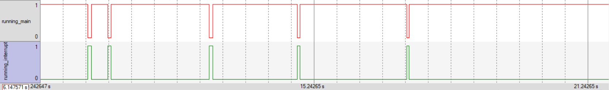
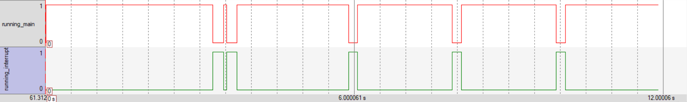
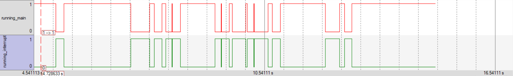

# Dokumentation
### Fragen
**Frage 1**

Die Default-Interrupt-Handler stehen in der Startup Datei des STM32 Boards.	Sie
sind mit dem Kompiler Schlüsselwort "Weak" vermerkt. Ist ein anderer Handler mit 
dem selben Namen definiert, wird der Default-Handler überschrieben.
Wollen wir also die ISR selbst definieren, muss die Funktion nur selbstständig
definiert werden:
``` C
void EXTI0_IRQHandler() {
}
```

**Frage 2**

Die EXTI-Struktur beinhaltet verschiedene Registeraddressen zur bestimmung
des External Interrupt Controllers. Für uns sind allerdings nur die Register
"IMR" (Interrupt mask register) und "RTSR" (Rising trigger selection register) von
Bedeutung. Wird ein Bit in IMR gesetzt, ist der zugehörige EXTI aktiviert.
Mit dem RTSR Register wird die Steigende Flanke als Auslöser für den Trigger 
angegeben

**Frage 3**

Für das freigeben und sperren eines Interrupts exestieren bereits Funktionen:
```C
NVIC_EnableIRQ(EXTI0_IRQn);		//Aktivieren des Interrupts
NVIC_DisableIRQ(EXTI0_IRQn);	//Deaktivieren des Interrupts
```
Diese verwenden Intern ein "Interrupt Set Enable Register" (ISER). Mit diesem
kann unabhängig von der Quelle ein Interrupt im NVIC aktiviert und deaktiviert werden.
Da für diese Lösung der EXTI0 Interrupt gewählt wurde, ist der IRQn_Type 
"EXTI0_IRQn" (=6).

**Frage 4**
```
            |----|    
ISR --------|    |-------

    --------|    |-------
main        |----|
```

Es läuft die Enlosschleife der main. Wird durch das Betätigen des Buttons, ein Interrupt ausglöst, unterbricht die zugehörige ISR die main. Ist die ISR fertig wird wieder die main aktiv.

**Frage 5**

Wir haben zwei Variablen eingeführt um mit Trace anzuzeigen was gerade aktiv ist. Ist die main aktiv, ist running_main 1. Wird ein Interrupt ausgelöst und dadurch eine ISR aktiv wird running_interrupt 1.

```C
void EXTI0_IRQHandler(EXTI0_IRQn) {
    running_main = 0;
    running_interrupt = 1;
}

void main() {
    running_main = 1;
    running_interrupt = 0;
}
```



**Frage 6**

a. Die ISR unterbricht die main, ist die ISR fertig, wird die main an der Stelle fortgesetzt, an der sie unterbrochen wurde.



b. Da der Interrupt am Anfang in der ISR ausgeschaltet wird, passiert bei mehrfachem Drücken nichts. Der Interrupt kann erst wieder ausgelöst werden, wenn er in der main wieder eingeschaltet wurde.

**Frage 7**

siehe Bilder in 6ab

**Frage 8**

Wird die main innerhalb dieser Funktion von einem Interrupt unterbrochen und die verwendet dieselbe Funktion, kann es passieren, dass der zweite Funktionsaufruf Variablen des Funktionsaufrufs in der main verändert, da einige Variablen nicht im Kontext gesichert wurden (z.b. Werte hinter Pointern)


